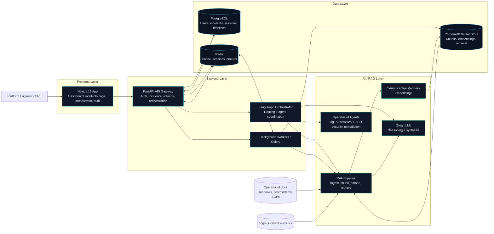

# AegisOps AI

AegisOps AI is an enterprise DevOps intelligence platform that combines a Next.js frontend, a FastAPI gateway, a LangGraph orchestration layer, and a RAG pipeline for incident analysis, remediation guidance, and operational knowledge retrieval.

## Architecture

## What the flow looks like

1. The user interacts with the Next.js frontend.
2. The frontend calls the FastAPI gateway for auth, incidents, logs, and orchestrator analysis.
3. PostgreSQL stores durable application data such as users, incident records, sessions, and timelines.
4. Redis handles fast-changing state such as queues, caching, session helpers, and worker coordination.
5. The orchestrator routes incident context into the RAG pipeline and specialized agents.
6. Operational documents and logs are embedded into ChromaDB, then retrieved back as context for Groq-based reasoning.
7. The final output is synthesized into recommendations, findings, and remediation guidance for the operator.

## Main Components

- Frontend: Next.js 15, TypeScript, TailwindCSS, shadcn/ui-style primitives, Framer Motion, Zustand, React Query, Monaco Editor, and Recharts.
- Backend: FastAPI, Pydantic, SQLAlchemy, Uvicorn, Celery, and Redis.
- AI: LangGraph, LangChain-style orchestration, ChromaDB, Sentence Transformers, and Groq LLMs.

## Key surfaces

- [frontend/](frontend/) contains the operator dashboard and architecture page.
- [services/api-gateway/](services/api-gateway/) contains the FastAPI gateway and persistence layer.
- [services/ai-orchestrator/](services/ai-orchestrator/) contains the multi-agent RAG and reasoning system.

## Architecture page

The rendered architecture view is available at /architecture in the frontend app.
